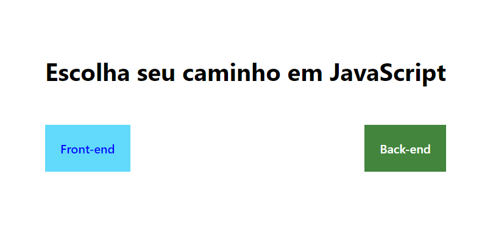
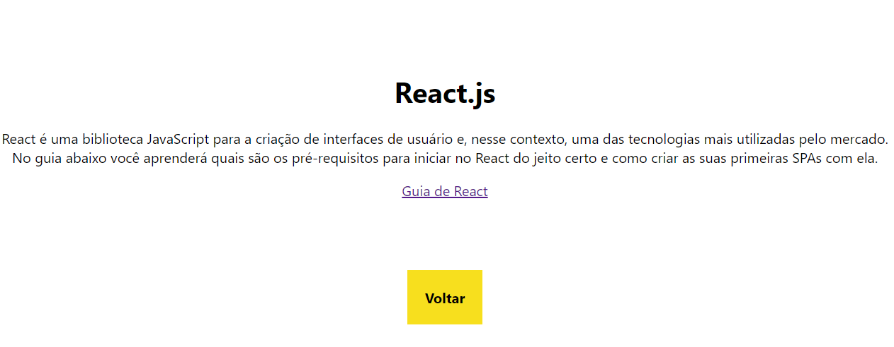
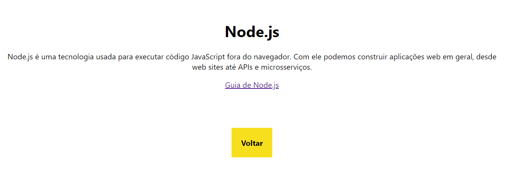

<h1 align='center'>Rotas</h1> 

 ### Este projeto foi desenvolvido seguindo os passos do curso "[Criando minhas primeiras rotas](https://www.devmedia.com.br/curso/react-criando-minhas-primeiras-rotas/2370)" ministrado na plataforma para [DevMedia](https://www.devmedia.com.br), o curso tem como objetivo demonstra de uma forma teórica e prática o conceito de rotas para construir a navegação de uma aplicação.
#### Conceitos abordados

- React router dom
    - Link
       - to
    - Route
        - exact
        - path
        - component
    - BrowserRouter
    - Switch

## Layout
---

        
    

        
    

        
    

## Certificado

    Certificado de conclusão do curso <a href="./img/certificado.pdf">Clique Aqui</a>

  
